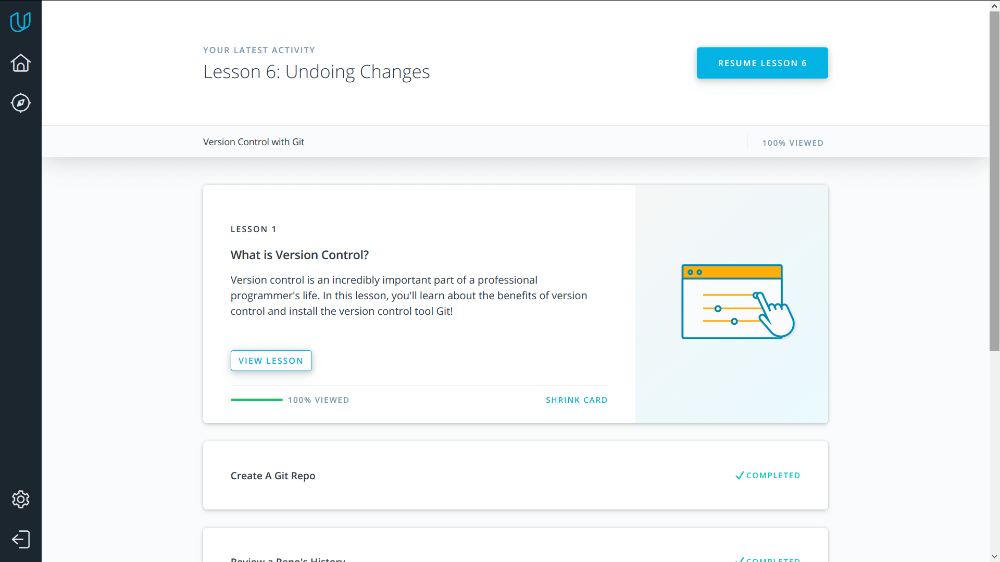

## Impressions of Task 1

1. The course on Udacity gave a firm understanding of basic Git functionality. It is perfect for
   beginners, since it makes sure everything is clear for you via practice tasks, quizes and reflections.
2. [learngitbranching.js.org](http://learngitbranching.js.org) (followed from [try.github.io](http://try.github.io))
   puts acquired knowledge to the test, and teaches some extra commands and techniques as well.
   Visualisations are great, but the only flaw is that I couldn't access from the menu levels
   starting from "remote" section.

Now I can hopefully say that I've learnt how to use Git.

## Linux CLI, and HTTP

1. *what was new to you*
   1. I had known some command before, but the course helped me learn some other useful ones
      and get it all ingrained im my mind.
   2. Every time it came to networks, I used to get lost. Now I've got a more clear understanding
      of how the HTTP protocol works and how clients and servers communicate.
   3. How authentication and caching are performed.
2. *what surprised you*
   1. Command line has its own text editor!
   2. I had never invegtigated status code meanings, so I was quite impressed when saw them all.
   3. There is so much detail about caching.
3. *what you intend to use in future*
   1. Hohestly, I don't think I'll use the command line in everyday life, but when working in git,
      for example, why not. Besides, bash scripting and modifying environment seem redundant.
   2. In a project that needs to exchange data between hosts.
   3. In a big project that requires traffic optimisations or tracking individual users.

## Git Collaboration

1. *what was new to you*
   1. Although I've finished a Git/Github course for Task 1, I learnt something from this course.
      Such as numerous flags for git log, or the .gitignore file.
   2. I got lots of advices about collaborating via Github.
2. *what surprised you*
   1. git log is powerful!
   2. Communicating with other developers turns out to be kinda complicated...
3. *what you intend to use in future*
   1. Everything. It is basic Git functionality.
   2. I will push my own works to remotes on Github, and, when the time comes, will send/manage
      pull requests on larger projects, as well as interact with other developers.
